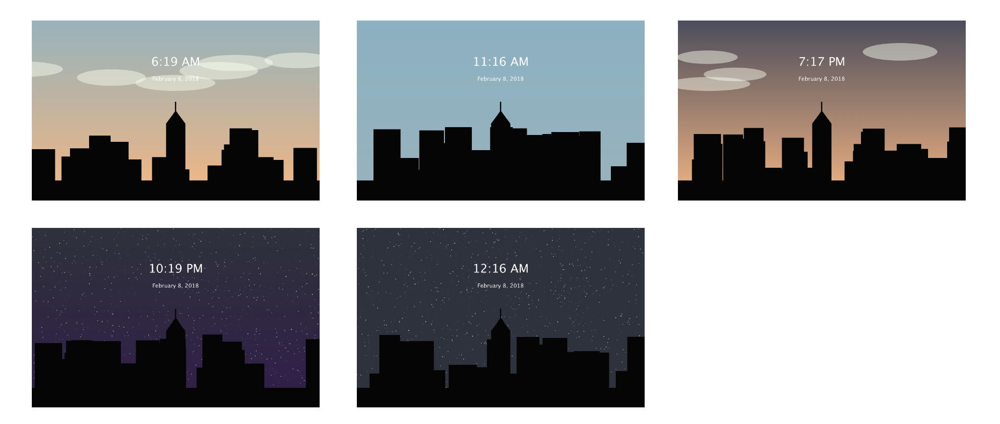

# screensaver
###Using Processing to Display a Time Sensitive Screensaver

####Assignment 06 for Programming Basics

This is a time sensitive screensaver. The background sky changes color depending on the time of the day. There are animated objects* that provide a sense of time passing, as well as the digital clock, which tell the time.

Clouds by day appear with random velocity; if you don't see clouds, wait a while and they will start appearing at random Y coordinates from x = 0 (left border of the screen).

In order to skip to certain times of the day, there are several  keystrokes that trigger examples to show how the background would look like at that certain timeframe. This is solely to see what the screensaver would look like at certain times of the day.

-------------------------------------------------------

Going horizontally on your keyboard:

`q` to `s` represent the AMs from 12AM -> 11AM 
`Q` to `S` represent the PMs from 12PM -> 11PM 

—> lowercase keys trigger midnight and morning times

—> uppercase keys trigger afternoon, evening, and night times

To go back to your original hour:

`m` or `M` will change the display

Enjoy!

------

#### Example Screenshots:

